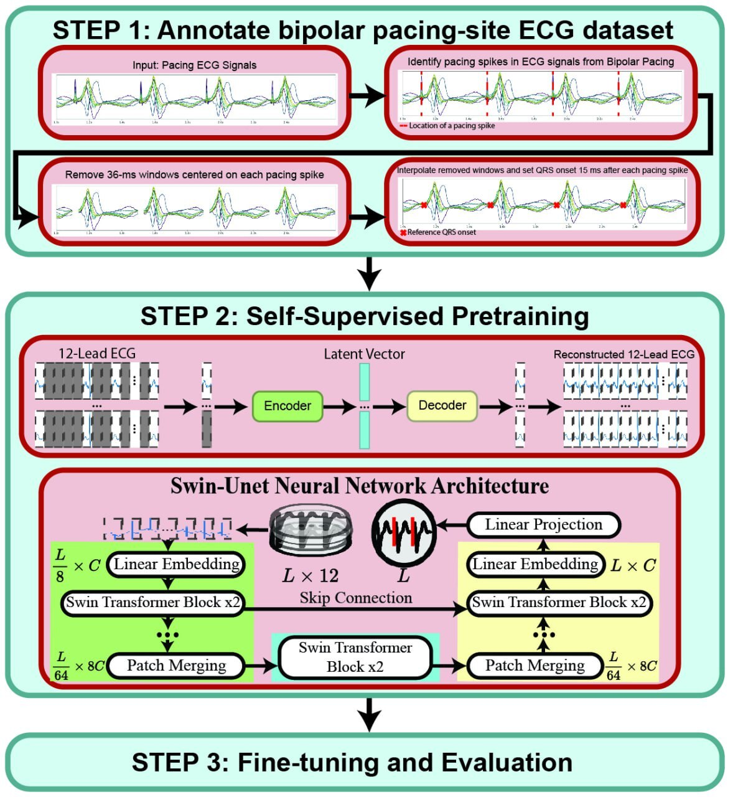

# Comparing ECG-Lead Subsets for Heart Arrhythmias/ECG Patterns Classification: Convolutional Neural Networks and Random Forest 



**Abstract:** Despite Deep Learning (DL) growth in popularity, limited research has compared the performance of DL to Conventional Machine Learning (CML) methods in heart arrhythmia/ECG patterns classification. Additionally, the classification of heart arrhythmias/ECG patterns is often dependent on specific ECG leads for accurate classification, and it remains unknown how DL and CML methods perform on reduced subsets of ECG leads. In this study, we aimed to assess the accuracy of DL and CML methods for classifying arrhythmias/ECG patterns using reduced ECG-lead subsets. We used a public dataset from the PhysioNet Cardiology Challenge 2020. For the DL method, we trained a Convolutional Neural Network (CNN) classifier extracting features for each ECG lead, which were then used in a feedforward neural network. We employed a Random Forest classifier with manually extracted features for the CML method. Optimal ECG-lead subsets were identified using recursive feature elimination for both methods. The CML method required 19% more leads (equating to approximately 2 leads) when compared to the DL method. Four common leads (I, II, V5, V6) were identified in each of the subsets of ECG leads using the CML method, and no common leads were consistently present for the DL method. The average macro F1 score was 0.761 for the DL and 0.759 for the CML. In conclusion, optimal ECG-lead subsets provide comparable classification accuracy to using all 12 leads across DL and CML methods. The DL method provided higher accuracy in classification for larger datasets by a small margin and also required fewer ECG leads than CML method

## Requirements

The requirements for running the projects can be found in *requirements.txt* file. You can create a conda environment with the requirements using the following command:

```bash
conda create --name ENV_NAME --file requirements.txt
```

## Train & Eval

The project contains a variety of steps to train the neural network. Please the configuration files in a config folder, and adjust accordingly considering your computational capabilities and which arrhythmia is being tested.

To run a convolutional neural network pipeline, use the following command:

```bash
./run_dl_pipeline.sh
```

To run a random forest pipeline, use the following command:

```bash
./run_cml_pipeline.sh
```